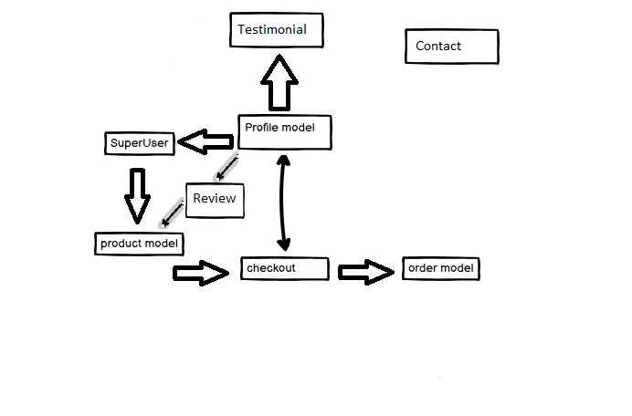

# PC GEEKS 

- [UX](#ux)
  - [Project Goal](#project-goal)
  - [User Stories](#user-stories)
    - [User Stories for Customers](#user-stories-for-customers)
    - [User Stories for Shop Administrators](#user-stories-for-shop-administrators)
  - [Wireframes](#wireframes)
  - [Data Structure](#data-structure)
  - [Design](#design)
    - [Colors](#colors)
- [Features](#features)
  - [Existing Features](#existing-features)
    - [Home Page](#home-page)
    - [Product Listing](#product-listing)
    - [Product View](#product-view)
    - [User Account](#user-account)
    - [Shopping Cart](#shopping-cart)
    - [Payment](#payment)
    - [Administrator features](#administrator-features)
    - [About us](#About-us)
    - [Contact](#Contact)
  - [Features Left to implement](#features-left-to-implement)
- [Testing](#testing)
- [Deployment](#deployment)
  - [Deployment to Heroku](#deployment-to-heroku)
- [Technologies](#technologies)
- [Tools Used](#tools-used)
- [Credits](#credits)
  - [Media](#media)
  - [Acknowledgements](#acknowledgements)
- [Changes](#Changes)
---

PCGeeks is a gamer shop with components for PC and got an UX that is designed more to the female side of the buisness. 

The site has been deployed to Heroku and can be viewed [here](https://pcgeeks.herokuapp.com/).

## UX

### Project Goal

This project is my fourth and final Milestone Project in the Code Institute's Fullstack Development program. I made a e-commerce that reach out for women that are into gaming. THe site id fully functional and to get it up and running as a usable site the only thing that missing is a few setups for stripe and an account on stripe to recieve the payment. 

### User Stories

#### User Stories for Customers

| **As a customer I would like to** | **So that I can**                             |
| -------------------------------------------------- | --------------------------------------------- |
| Browse products                                    | purchase what I need                          |
| Search products                                    | find something specific                       |
| Filter products                                    | compare the offerings                         |
| See offerings by a specific producer               | get an idea of the producer's offer           |
| Buy a product                                      | get the parts im looking for                  |
| Pay using a card                                   | complete my purchase                          |
| Create a profile                                   | save my information and review past orders    |
| Update my profile information                      | if i move houses and chage shipping info      |
| See my shopping cart before paying                 | know the cost and content before the purchase |
| Update my shopping cart                            | make decisions before the purchase            |
| See details about a product                        | make an informed purchasing decision          |
| View my order history                              | be reminded of previous purchases             |
| Receive an email confirmation about my order       | have archived information about it            |
| Contact the seller                                 | know about the status of an order             |

#### User Stories for Shop Administrators

| **As an administrator I would like to**     | **So that I can**                                |
| ------------------------------------------- | ------------------------------------------------ |
| Add/Update/Remove a product                 | keep the store up to date                        |
| Add/Update/Remove a producer                | keep users informed about the latest information |
| Receive orders from customers in my mailbox | fulfill the orders                               |

### Wireframes

Following these user stories, wireframes were drawn to provide a starting point and guidance throughout the development process.

### Data Structure

Before starting the development of the application, its models and their relationships were delineated.
This was as always just a rough plan on how i planned it in my mind and as the project move forward some things changed and some things stayed as i planned it. 

### Design

#### Colors

As im building a page aimed to catch the eye of the female gaming world, ive choosen to use colors that more often appeal to that audience. Still i needed to keep the readability on the site so therfore i went to use the violet coloron black and use these colors in diffrent varieties. I used them both with opacity to be able to hightligt the information i want to get to the user. the white behind the products is used so that the products is lifted and shown in all its glory, since this is the main purpose off the site itself. 

## Features

### Existing Features

#### Home Page

-   The first view that meets the customer is a simple design with the navbar and a button to go to the products. 
-   the navbar opens up the possibility to login/register or sort through the products if wished. 

#### Product Listing

The shop offers a number of solutions to make specific products easier to list and find.

-   A search function lets users find specific products
-   A product listing can be sorted by price, name, and category or rating
-   Through the serach function they can search if a keyword appers in description or name. 

#### Product View

-   A user can view the details of a product, which includes the following:
    -   Product name
    -   Image
    -   Producer
    -   Description
    -   Rating
    -   Price
    -   Category
-   Users can choose a quantity and add it to their cart

- Reviews from people that own this product. this can be used by anyone even if they didnt buy it from us. But all reviews needs to be approved. 

#### User Account

The creation of the account requires a valid email, a user name, and a password.
The creation of an account gives access to the following features:

-   Update of profile information
-   View the account's order history

#### Shopping Cart

-   Items chosen for purchase are placed in the shopping cart
-   The shopping cart displays subtotals for items placed in it and a grand total cost
-   Quantities for the products can be adjusted or removed from within the shopping cart
-   A user can choose to proceed to checkout

#### Payment

-   The checkout details and delivery information are pre-filled with the information provided in the user's profile, but can be edited.
-   A summary of the order is displayed on the checkout page
-   Payment is made by card using [Stripe](https://stripe.com/)

#### Administrator features

-   On product pages, an administrator has additional links to edit a products information or remove it from the shop
-   An administrator can via members tab add a new product to the shop manually
-   The administraor has the option of updating or deleting a product in either the detailed view of a product or in the product overview.
#### About us

- Short information about the store
- Testimonaials from other customer based on their expirience with us.
- Form to leave a testimonial. needs to be a logged in user aswell as the testimonial needs to be approved. 

#### Contact

- Contact form if they need to get it touch.
- Sends a mail to the store mail to let us know someone needs to get it touch.

### Features Left to implement

-   For authenticated users, the option should be added to renew an order if they want.
-   the choice of deleting a whole account by the users own choice. (GDPR states that you got the right to be forgotten)
-   Help the user to start a warranty claim or a service directly from their profile page.
-   Recommended products that goes well with the ones in the cart.
-   Technical specifications for the products that being sold on the site.
- Put rating on specific products that will scale the rating that is set in DB atm.

## Testing

Testing was done manually throughout the development process. The full rundown of the testing can be found [here](TESTING.md).

Additionally, all code was validated in the following ways:

**HTML** - All pages have been successfully run through the [W3C HTML Validator](https://validator.w3.org/) to make sure no problems found within HTML code.

**CSS** - CSS validation with the [W3C Jigsaw Validator](https://jigsaw.w3.org/css-validator/) came back with nothing to mark upon.

**Python** - All Python code was checked with the [PEP8 online validator](http://pep8online.com/) and is PEP8 compliant, aside from line length flags, which were left for code readability. fixes found were trailing whitelines or missing double lines between classes mostly.

## Deployment

Before deploying the application, ensure the following are installed:

-   Python 3
-   PIP
-   Git

The application relies on the following services, and accounts will have to be created for them:

-   [Amazon AWS](https://aws.amazon.com/)
-   [Stripe](https://stripe.com/)

### Deployment to Heroku

To deploy pcgeeks to Heroku, use the following steps:

1. In Heroku create a new application.
2. From the heroku dashboard of your application, click on "Deploy", then "Deployment method" and select GitHub to connect the application to your github repository
3. In the Heroku Resources tab, navigate to the Add-Ons section and search for Heroku Postgres. The hobby level can be selected for this application.
4. Click on the "settings" tab and on the button labelled "Reveal Config Vars". The Postgres addon will have created a link to the Postgres database.
5. Add the following configuration variables to the application:

    | **VARIABLE**          | **VALUE**                                                          |
    | --------------------- | ------------------------------------------------------------------ |
    | AWS_ACCESS_KEY_ID     | The key provided by AWS                                            |
    | AWS_SECRET_ACCESS_KEY | The secret key provided by AWS                                     |
    | DATABASE_URL          | Postgres Database url provided by the addon                        |
    | DEFAULT_ORDER_EMAIL   | The email address orders will go to                                |
    | EMAIL_HOST            | The smtp host for the email                                        |
    | EMAIL_HOST_PASSWORD   | The password associated with the address that will send out emails |
    | EMAIL_HOST_USER       | The address that will send out emails                              |
    | SECRET_KEY            | Your Django secret key                                             |
    | STRIPE_PUBLIC_KEY     | The public key provided by Stripe                                  |
    | STRIPE_SECRET_KEY     | The secret key provided by Stripe                                  |
    | STRIPE_WH_SECRET      | The webhook secret provided by Stripe                              |
    | USE_AWS               | True                                                               |

6. In the Heroku dashboard, deploy the application.
7. To view the site, click "View App"

## Technologies

-   HTML
-   CSS
-   JavaScript / jQuery
-   Python
-   Django
-   Fixture files are written by myself and my brother [Hampus Nilsson](https://github.com/Knasten).

## Tools Used

-   Github
-   Balsamiq
-   Heroku
-   Mailchimp for newsletter
-   W3schools for research
-   [Font Awesome](https://fontawesome.com/)
-   [TinyJPG](https://tinyjpg.com/) used to compress all images

## Credits

### Media

-   Icon for "No photo available" image from [Flat Icons](https://www.flaticon.com/authors/flat-icons)
-   Information for the fixture files are picked up from BestBuy US and Amazon using stock pictures from the manufactors, these are ok to use for educational purpose. 
- back to top button is from W3schools with some alternation in style and minimal in function.
     

### Acknowledgements

-   This site is meant for educational use only.
-   [Felipe Alarcon](https://github.com/fandressouza) for his helpful feedback and advice, and constant availability as a mentor
-   Thanks to [Hampus Nilsson](https://github.com/Knasten) for both the help along the way and for the exchange of information, aswell as the good work on building the fixture files together. 
-  And last but not least thank you to CI for the best Walkthrough project off the entire course.

### Changes

- Models for Tesitimonial, reviews and contact was added to the project
- Forms for these models were added and implemented on site.
- About us page was added housing Testimonials.
- Contactpage was added to house the contact form.
- Reviews for resides on product detail.
- Facebook page was connected. rest of social links are still dummies. 
- Newsletter from mailchimp was inplemented and tested. 
- Sitemap.XLM and Robots.txt was added to repository.
- Back to top button added for products.
- Overhaul in alot of the styling.
